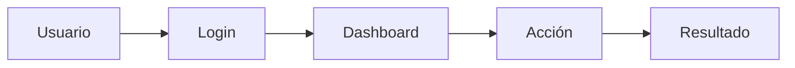

# Diseño de Producto

> **Proyecto**: [NOMBRE_DEL_PROYECTO]
> **Versión**: 1.0.0
> **Fecha**: [FECHA]

---

## 1. Visión del Producto

### Problema
[Describe el problema que resuelve tu producto]

### Solución
[Describe tu solución]

### Propuesta de Valor
[¿Por qué alguien elegiría tu producto?]

---

## 2. Stakeholders

### Usuarios Objetivo

| Tipo | Descripción | Necesidades |
|------|-------------|-------------|
| [Usuario] | [Descripción] | [Nec1, Nec2] |

### Roles

| Rol | Permisos |
|-----|----------|
| admin | Acceso total |
| user | Acceso estándar |
| guest | Solo lectura |

---

## 3. Funcionalidades

### Core Features

| Feature | Prioridad | Dependencias |
|---------|-----------|--------------|
| [Feature 1] | Must | - |
| [Feature 2] | Must | Feature 1 |
| [Feature 3] | Should | - |
| [Feature 4] | Could | - |

### Features por módulo

#### Módulo: [Nombre]
- [ ] Funcionalidad 1
- [ ] Funcionalidad 2

---

## 4. User Flows

### Flujo Principal

### Flujos Alternativos

- [ ] Flujo 1
- [ ] Flujo 2

---

## 5. Requisitos No Funcionales

| Requisito | Target |
|-----------|--------|
| Performance | < 2s respuesta |
| Disponibilidad | 99.5% |
| Seguridad | HTTPS, JWT |
| Mobile | Responsive |

---

## 6. Mockups/Wireframes

[Referencia a PROTOTYPE.html para ver el diseño visual]

---

*Este documento define QUÉ se va a construir*
