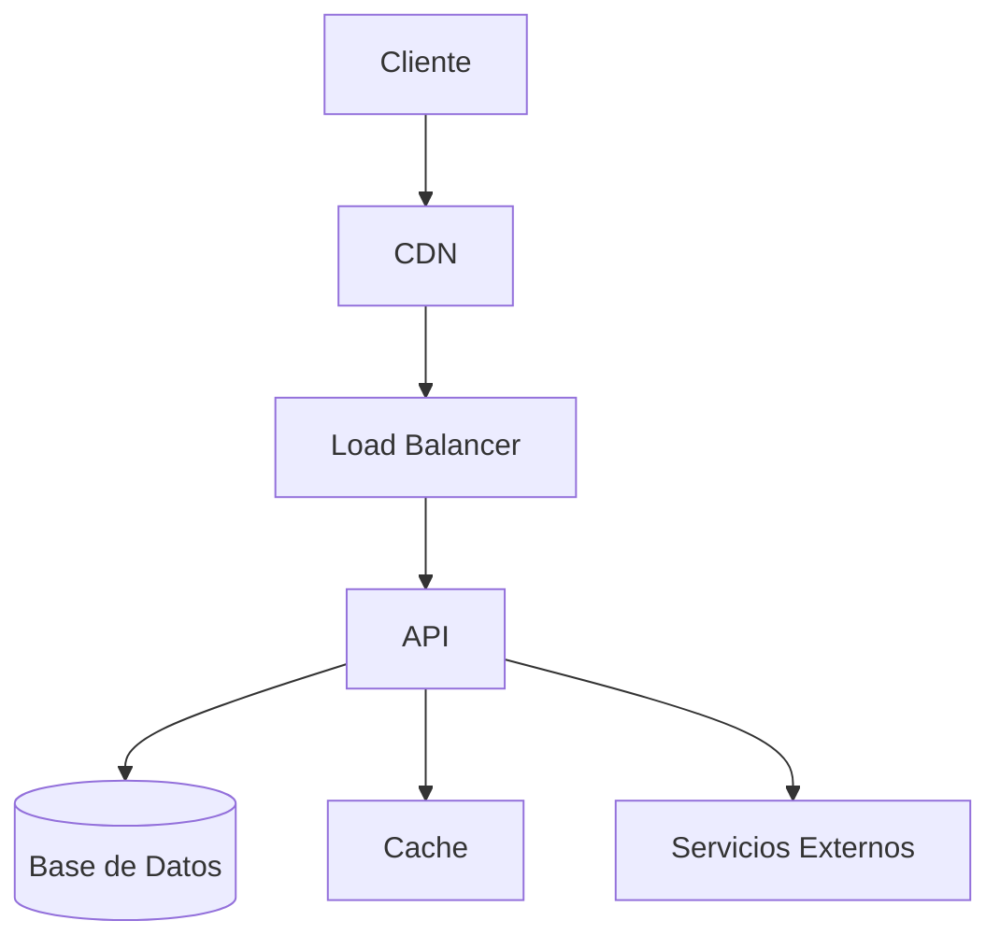

# Análisis Técnico

> **Proyecto**: [NOMBRE_DEL_PROYECTO]
> **Fecha**: [FECHA]

---

## 1. Stack Tecnológico

### Frontend

| Tecnología | Versión | Justificación |
|------------|---------|----------------|
| React | 18.x | [Razón] |
| TypeScript | 5.x | [Razón] |
| Tailwind CSS | 3.x | [Razón] |
| Zustand | 4.x | [Razón] |
| React Query | 5.x | [Razón] |

### Backend

| Tecnología | Versión | Justificación |
|------------|---------|----------------|
| .NET | 8.x | [Razón] |
| Entity Framework | Core | [Razón] |
| SQL Server | 2022 | [Razón] |

### Infraestructura

| Servicio | Propósito |
|----------|-----------|
| Azure App Service | Hosting |
| Azure SQL | Base de datos |
| GitHub Actions | CI/CD |

---

## 2. Arquitectura

### Diagrama de Componentes



### Patrones de Diseño

| Patrón | Uso |
|--------|-----|
| Repository | Acceso a datos |
| Unit of Work | Transacciones |
| DTO | Transferencia datos |
| JWT Auth | Autenticación |

---

## 3. API Design

### Endpoints Principales

| Método | Endpoint | Descripción |
|--------|----------|-------------|
| GET | /api/resource | Listar |
| GET | /api/resource/:id | Ver uno |
| POST | /api/resource | Crear |
| PUT | /api/resource/:id | Actualizar |
| DELETE | /api/resource/:id | Eliminar |

### Formato de Respuesta

```json
{
  "success": true,
  "data": {},
  "message": "Operation successful"
}
```

---

## 4. Base de Datos

### Esquema

#### Tabla: [Nombre]

| Columna | Tipo | Restricciones |
|---------|------|---------------|
| id | INT | PK, AUTO_INCREMENT |
| name | VARCHAR(100) | NOT NULL |
| created_at | DATETIME | DEFAULT NOW() |

### Relaciones

```
[Tabla1] 1:N [Tabla2]
[Tabla3] N:M [Tabla4]
```

---

## 5. Seguridad

| Aspecto | Implementación |
|---------|----------------|
| Autenticación | JWT Bearer |
| Contraseñas | bcrypt |
| HTTPS | Siempre |
| CORS | Configurado |
| Rate Limiting | [Sí/No] |

---

## 6. Integraciones

| Servicio | Propósito | Tipo |
|----------|-----------|------|
| [Servicio] | [Uso] | API/SDK |

---

## 7. deployment

| Ambiente | URL | Descripción |
|----------|-----|-------------|
| Dev | dev.[dominio] | Desarrollo |
| Staging | staging.[dominio] | Pruebas |
| Prod | [dominio] | Producción |

---

*Este documento define CÓMO se va a construir*
